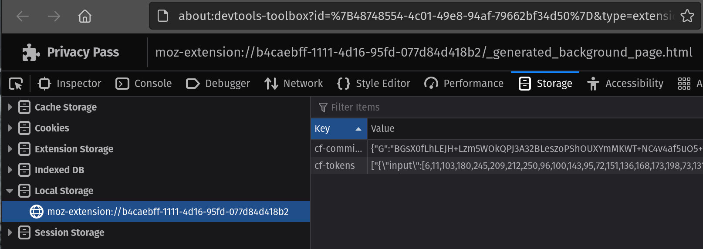

# Privacy Pass

[](https://drone.sergeserge.com/SergeBakharev/privacypass)
[](https://badge.fury.io/py/privacypass)
[](https://opensource.org/licenses/MIT)
[](https://pypi.org/project/privacypass/)

A Python module implementing the Privacy Pass protocol. Privacy Pass is supported by Cloudflare (and is in the process of becoming standardised by the IETF) to enable users to redeem passes instead of having to solve CAPTCHAs to visit protected websites. This can be useful when programmatically interacting with such sites, as CAPTCHAs are intentionally used to tell Computers and Humans Apart.

## Installation

Simply run `pip install privacypass`. The PyPI package is at [pypi.python.org/pypi/privacypass](https://pypi.python.org/pypi/privacypass)

Alternatively, clone this repository and run python setup.py install.

## Dependencies

* Python >= 3.9
* [cryptography](https://cryptography.io/) >= 36.0.1

## Usage

Call `privacypass.redemption_token()` to create a redemption token specific to the site/path.

``` python
import requests
import privacypass

# See `Receiving Privacy Pass Tokens` section of doc for how to retrieve tokens
cf_token = {"input":[98,207,READACTED,234,181],"factor":"0x5c57a03...REDACTED..68ef47","blindedPoint":"BAV...REDACTED...dss=","unblindedPoint":"BOu0AArK..REDACTED..jdBbeqo=","signed":{"blindedPoint":"BPs6ed..REDACTED..0ZWw=","unblindedPoint":"BHtp..REDACTED..hU0="}}

url = 'https://somewhere.with.captcha'
request = requests.get(url)

# A Privacy Pass compatible CF site is encountered
# and a CAPTCHA challenge is presented
if request.status_code == 403 and 'CF-Chl-Bypass' in request.headers:
    cf_redemption_header = privacypass.redemption_header(token=cf_token, url=url, method='GET')
    request = requests_session.get(url, headers=cf_redemption_header)
```

## Troubleshooting Notes

* Tokens have a limited life span. 30 days?
* Note the header in token redemption response `'CF-Chl-Bypass-Resp': '<error-resp>'`. \<error-resp\> is the error value returned by the privacy pass verifier. Possible values are 5 or 6, where 5 is an edge-side connection error and 6 is a pass verification error.

## Receiving Privacy Pass Tokens

Currently the easiest way to receive tokens is by having the [Browser Extension](https://privacypass.github.io/) installed, and browsing to [captcha.website](https://captcha.website).

1. Solve a number of CAPTCHAs on [captcha.website](https://captcha.website). Each CAPTCHA solved grants 30 tokens.
2. Extract the tokens from your browser:

    **Firefox**

    1. Browse to the *Extension Debug screen* - (about:debugging#/runtime/this-firefox)
    2. *Inspect* the *Privacy Pass* extension
    3. Open Storage -> Local Storage
    4. Tokens are stored as a list under the `cf-tokens` key.

    

## Acknowledgements

This module is a porting of key functions from the [Privacy Pass Extension](https://github.com/privacypass/challenge-bypass-extension) by @privacypass team.
